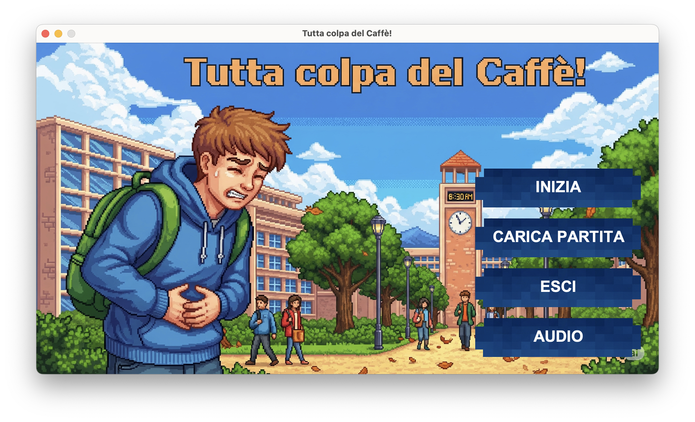
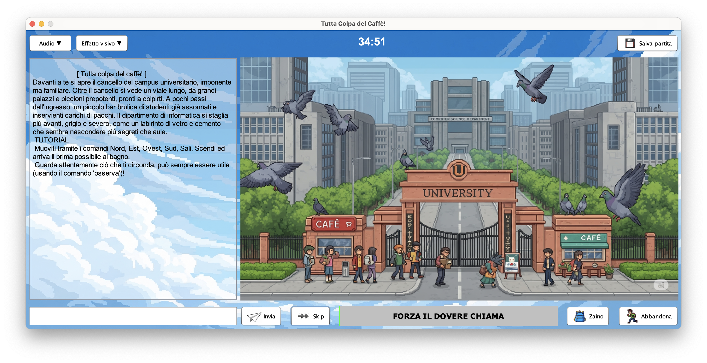
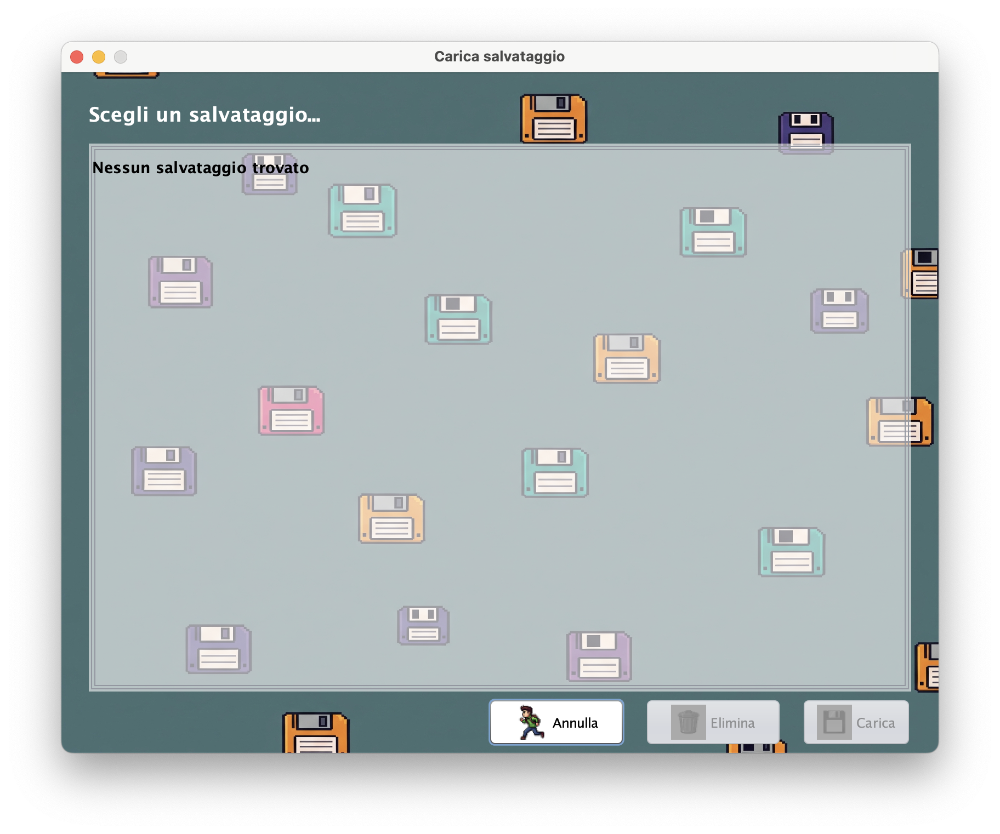
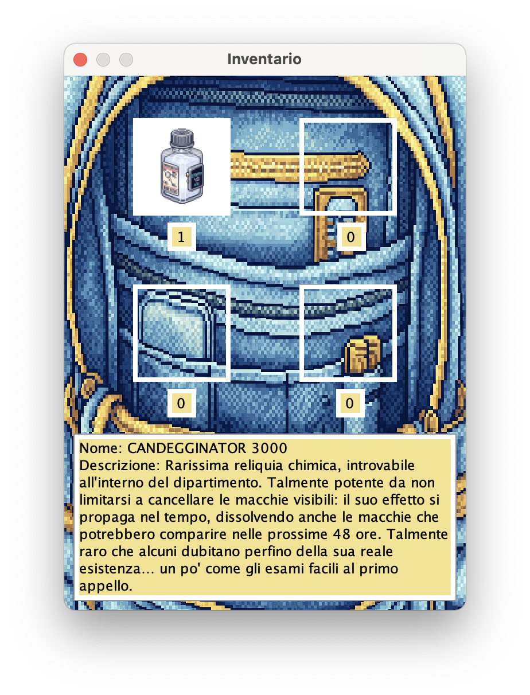
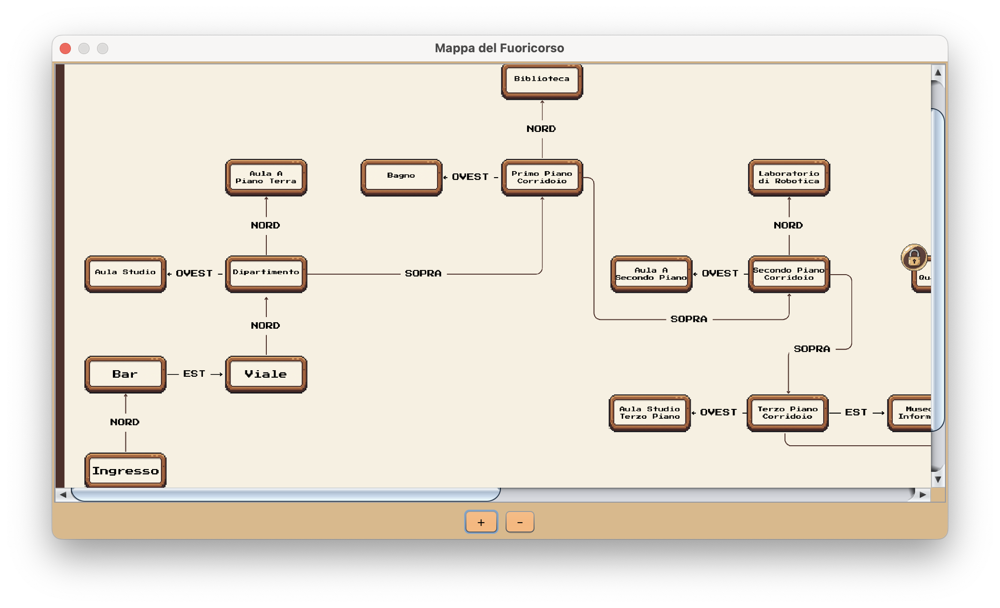
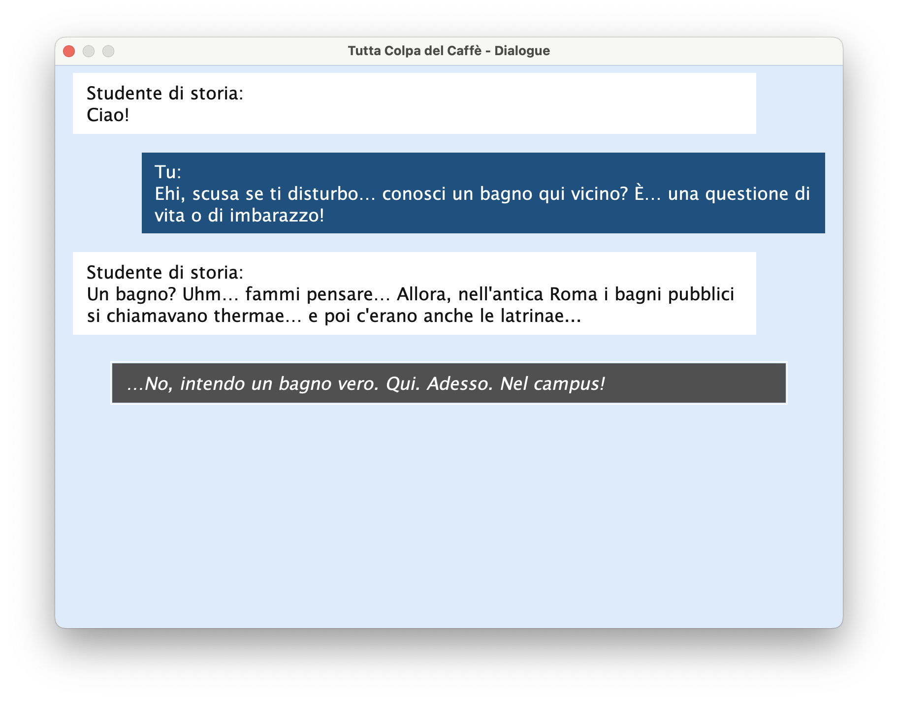
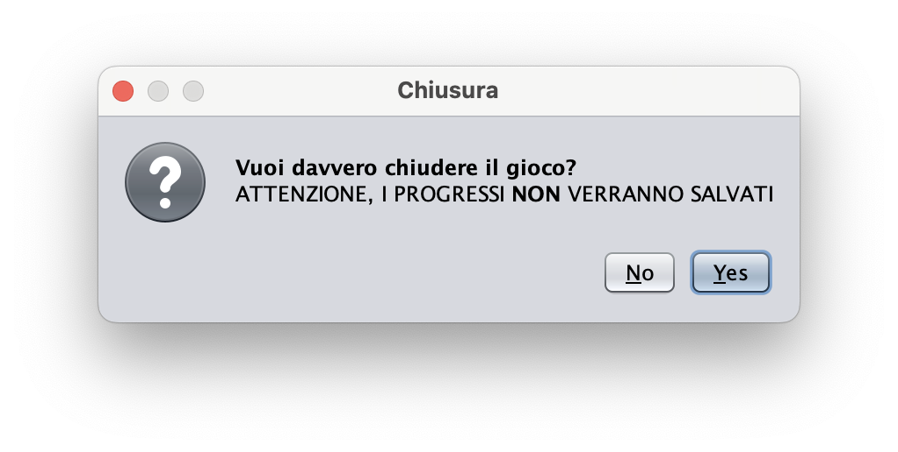

<div align="center">
    <h1>Tutta colpa del caffè</h1>
    
    <h3>Esame di Metodi Avanzati di Programmazione</h3>
    <h3>(track M-Z)</h3>
    <h3>A.A. 2024-2025</h3>

</div>

## Caso di studio a cura di
- Patruno Mirko ([@mirkopat](http://github.com/mirkopat))
- Vendola Giovanni ([@Giovanni0910](http://github.com/Giovanni0910))
- Vittore Giovanni ([@giovav](http://github.com/giovav))

---
## Indice
- ### [Introduzione](#introduzione-1)
- ### [Descrizione dell'avventura](#descrizione-dellavventura-1)
- ### [Progettazione](#progettazione-1)
  - #### [Individuazione delle classi e Competenze](#individuazione-delle-classi-e-competenze-1))
  - #### [Organizzazione in packages](#organizzazione-in-packages-1)
- ### [Diagramma delle classi](#diagramma-delle-classi-1)
- ### [Specifica algebrica](#specifica-algebrica-1)
- ### [Dettagli implementativi](#dettagli-implementativi-1)
  - #### [Programmazione generica](#programmazione-generica-1)
  - #### [Files](#file)
  - #### [DataBases](#database-jdbc)
  - #### [Lambda Expressions](#lamba-expression)
  - #### [Swing](#swing-1)
  - #### [Threads e programmazione concorrente](#thread-e-programmazione-concorrente)
  - #### [Socket e API RESTful](#socket-e-api-restful-1)
- ### [Modo più veloce per vincere](#modo-più-veloce-per-vincere-il-gioco)
---
# Introduzione
Questo gioco nasce come progetto per l'esame di Metodi Avanzati di Programmazione e ha come finalità
quella di mettere in pratica le conoscenze acquisite riguardanti il paradigma di programmazione ad oggetti (e in parte anche riguardo a quello funzionale) mediante l'utilizzo del linguaggio di programmazione "Java". 
Le modalità d'esame prevedono che si debba implementare un'avventura testuale (con il possibile utilizzo di interfacce grafiche GUI implementabili mediante la liberia Swing).
Lo sviluppo di questa avventura testuale ci ha permesso di consolidare, e vedere dal punto di vista pratico, gli elementi del paradigma operazionale orientato agli oggetti, come l'uso di **classi** e **oggetti** (facendo focus sulla loro struttura), il concetto di **incapsulamento**, di **ereditarietà** nei suoi diversi tipi e forme, di **polimorfismo** (universale e ad hoc) e molto altro...
Ci ha permesso, inoltre, di imparare un nuovo linguaggio di programmazione e di imparare gli elementi che mette a disposizione (trattati nel dettaglio in seguito). 

# Descrizione dell’avventura
Tratto (quasi) da una storia vera.
È una calda 🥵 mattina di luglio. Uno studente di Informatica si sta dirigendo al Dipartimento per sostenere uno degli esami più temuti del corso di laurea: Metodi Avanzati di Programmazione.

Tutto sembra andare secondo i piani... finché, non appena varcato l'ingresso del campus, viene colto da un’improvvisa, impellente esigenza fisiologica 😰.

Inizia così un'odissea tragicomica tra i corridoi dell’università. Nessun bagno sembra essere facilmente accessibile, ogni porta è chiusa, ogni indicazione fuorviante. Lo studente dovrà esplorare a fondo il campus, raccogliere indizi, affrontare dialoghi surreali e cercare aiuto da personaggi secondari come studenti fuori corso, baristi svogliati, inservienti criptici e persino macchinette del caffè apparentemente senzienti.

Riuscirà a trovare un bagno funzionante prima che sia troppo tardi? E soprattutto, ce la farà ad arrivare in tempo all’esame senza compromettere il proprio futuro accademico?

Un’avventura testuale tra il grottesco e il quotidiano, dove ogni scelta può fare la differenza.

Preparati a ridere, riflettere... e correre💨.

[👆🏻 Torna all'indice ☕️](#indice)

---

# Progettazione
### Individuazione delle classi e Competenze
La suddivisione delle competenze o **responsabilità** delle classi viene effettuata secondo il principio di presentazione separata **Entity, Control, Boundary** (**ECB**), dove ogni classe ha una propria responsabilità.
Più precisamente, le responsabilità costituiscono il ciò che un’istanza di una classe è destinato a fare.
Andando ad assegnare responsabilità precise per ogni classe si va a rendere le classi invarianti ai cambiamenti tra loro.

In questo progetto le classi sono state suddivise per competenze all'interno di relativi packages (entity, control, boundary) e, a livello superiore, è stata effettuata un'ulteriore raggruppamento per "aree" dell'applicativo: `game`, `start`, `loadAndSave` e `rete`; in questo modo abbiamo ottenuto una suddivisione per competenze corretta e, inoltre, la facilità di **individuare** le classi corrette per ogni area dell'applicativo.

[👆🏻 Torna all'indice ☕️](#indice)

---

### Organizzazione in packages
Per praticità e per coerenza con la suddivisione ECB delle competenze, come già specificato in precedenza, questo progetto è stato scomposto in più package.
Inizialmente il progetto è stato scomposto in **4 packages** principali, che hanno dato vita ai seguenti **4 namespaces** principali:
- `it.tutta.colpa.del.caffe.game`: contiene tutte le classi che permettono il funzionamento e la rappresentazione della partita vera e propria. Il package contiene anche tutte le interfacce grafiche (GUI) che permettono all'utente di interfacciarsi con la partita.
- `it.tutta.colpa.del.caffe.loadsave`: contiene tutte le classi che permettono il funzionamento del caricamento e del salvataggio di una partita in memoria (su file come chiariremo in seguito) e le classi che permettono la visualizzazione della GUI che permette all'utente di poter selezionare e caricare un salvataggio dal disco rigido.
- `it.tutta.colpa.del.caffe.rete`: contiene tutti gli strumenti necessari al funzionamento di un piccolo server che gestisce un database per rispondere alle richieste di uno (o volendo anche più di uno) client(s), i quali richiedono le informazioni iniziali per poter istanziare correttamente una partita in memoria e/o aggiornare i dati già scaricati ad inizio partita qualora fosse necessario.
- `it.tutta.colpa.del.caffe.start`: contiene tutte le classi per poter rappresentare e gestire il launcher del gioco.
All'interno del namespace principale `it.tutta.colpa.del.caffe`, il package che contiene tutti gli altri packages, è presente anche la classe `TuttaColpaDelCaffe`, classe **static** che rappresenta l'access point per l'intero gioco. All'interno della classe, infatti, viene avviato la classe `StartHandler`, che collega il controller alla GUI iniziale, e la classe `Server`, anch'esse entrambe statiche.
I packages `game`, `loadsave` e `start` vengono suddivisi in ulteriori sotto-packages, principalmente `entity`, `boundary` e `control` (fatta eccezione per le aree che non necessitano la memorizzazione dei dati su disco ove, ovviamente, non viene inserito il package `entity`).
Il package `game`, a differenza degli altri package, sviluppa una struttura di sotto-packages più complessa, infatti include, oltre ai packages citati in precedenza, anche:
- Il package `exception` che contiene tutti gli **errori** ed **eccezioni** che si possono verificare a runtime durante la partita. Le eccezioni sono importanti al fine di poter gestire uno specifico errore sempre durante il corso della partita;
- Il package `rest` che contiene tutte le classi necessarie all'implementazione del quiz finale del gioco che, se passato, porta alla vittoria. Il package prevede le classi che permettono di effettuare una richiesta rest ad un'API di *trivia games* e successivamente, presa la risposta della prima API, effettuare una seconda richiesta ad un'API traduttore che traduce la risposta della prima API in italiano;
- Il package `utility` che contiene tutte le classi di supporto all'implementazione della partita, come il `Parser`(che non necessita di presentazioni), tipi `Enum` vari, il `Clock` per implementare il timer del gioco, `TypeWriterEffect` che implementa l'effetto "macchina da scrivere" nella GUI e la classe `Audio manager` che gestisce l'audio della partita.

Il package `rete` non viene suddiviso ulteriormente in packages perché tutte le classi che contiene sono di tipo `control` (non c'è nessuna necessità - se non per info di debug già provviste - di comunicare con l'esterno per quest'area dell'applicativo).

Ogni package `game`, `loadsave` e `start` ha la propria classe `Handler` che si occupa di gestire il **binding** tra la GUI e il proprio controller. Questo può essere fatto molto facilmente, pur mantenendo un **basso accoppiamento**, come le buone norme dell'ingegneria del software prevedono, mediante l'uso di **Interfacce**.
In java le interfacce costituiscono la specifica sintattica di metodi che una classe andrà a implementare e sono un meccanismo molto potente. Applicando il polimorfismo ad oggetti che implementano le interfacce è possibile utilizzare gli oggetti senza conoscerne il reale tipo, per questo se in futuro verranno effettuate modifiche di implementazione alle GUI o ai Controller, nessuna controparte necessiterà di ulteriori modifiche (**codice invariante rispetto ai cambiamenti**).

Segue un breve riassunto delle competenze di ciascuna classe, raggruppate per packages:
- **`it.tutta.colpa.del.caffe.game`**:
  - `GameHandler`: Classe che fa il binding di GUI e controller della partita. Starta effettivamente la partita.
  - **`it.tutta.colpa.del.caffe.game.boundary`**:
    - `DialogueGUI`: Interfaccia che specifica i metodi necessari, privi di implementazione, che la GUI che mostra i dialoghi dovrà implementare;
    - `DialoguePage`: GUI che mostra un dialogo e permette al player di interfacciarsi con lo stesso (implementazione di DialogueGUI);
    - `GameEndedPage`: GUI che mostra lo scenario di fine partita (diviso per vittoria e sconfitta);
    - `GameGUI`: Interfaccia che specifica i metodi necessari, privi di implementazione, che la GUI che mostra la partita dovrà implementare;
    - `GamePage`: GUI che permette all'utente di interfacciarsi con la partita;
    - `GUI`: Interfaccia dalla quale ereditano tutte le altre interfacce-GUI. Contiene i metodi essenziali di un'interfaccia grafica comune. Necessaria per il principio di sostituibilità;
    - `InventoryPage`: GUI che mostra il contenuto dell'inventario e la descrizione degli oggetti che il player ha inserito nello stesso;
    - `MapPage`: GUI che mostra la mappa del gioco a seguito del prompt `mappa`, da parte dell'utente nella console di gioco (in `GamePage`).
  - **`it.tutta.colpa.del.caffe.game.control`**:
    - `Controller`: Interfaccia che contiene i metodi essenziali di un controller di una GUI;
    - `GameController`: Estensione dell'interfaccia controller, include le specifiche sintattiche di metodi necessari a comunicare adeguatamente con l'interfaccia di gioco;
    - `Engine`: Classe che gestisce l'intera logica della partita, caricandola o istanziandola adeguatamente;
    - `DialogueController`: Estensione dell'interfaccia controller, include le specifiche sintattiche di metodi necessari a comunicare adeguatamente con l'interfaccia che mostra i dialoghi;
    - `BuildObserver`: Classe che gestisce la logica del comando `costruisci`;
    - `LeaveObserver`: Classe che gestisce la logica del comando `lascia`;
    - `LiftObserver`: Classe che gestisce la logica del comando `ascensore` (o `sali/scendi` più comunemente);
    - `LookAtObserver`: Classe che gestisce la logica del comando `osserva`;
    - `MoveObserver`: Classe che gestisce la logica di movimento all'interno della mapppa;
    - `OpenObserver`: Classe che gestisce l'apertura di oggetti contenitore (comando `apri`);
    - `PickUpObserver`: Classe che gestisce la raccolta di oggetti mediante il comando `prendi`;
    - `ReadObserver`: Classe che gestisce la logica del comando `leggi`, potendo così mostrare il contenuto degli oggetti leggibili;
    - `ServerInterface`: Classe che permette di interfacciarsi correttamente con il server per effettuare correttamente tutte le richieste necessarie ad istanziare una partita o ad aggiornare lo stato del gioco (se necessario);
    - `TalkObserver`: Classe che gestisce i dialoghi e le interazioni con gli Non Player Characters nel gioco;
    - `UseObserver`: Classe che gestisce la logica del comando `usa`, permettendo al player di usare gli oggetti;
  - **`it.tutta.colpa.del.caffe.game.entity`**:
    - `CombinableItem`: Classe che rappresenta gli oggetti combinabili;
    - `Command`: Classe che rappresenta i comandi del gioco;
    - `ContainerItem`: Classe che rappresenta gli oggetti contenitore;
    - `DialogoQuiz`: Classe che rappresenta i dialoghi-quiz presi dal web tramite richiesta RESTful;
    - `Dialogue`: Classe che rappresenta gli oggetti combinabili;
    - `GameDescription`: Classe che rappresenta la descrizione del gioco. È un'implementazione di GameObservable;
    - `GameMap`: Classe che rappresenta la mappa di gioco;
    - `GameObservable`: Interfaccia che rappresenta i metodi necessari ad una classe per poter essere osservata dal gioco mediante gli Observers;
    - `GameObserver`: Interfaccia che rappresenta il generico observer;
    - `GeneralItem`: Classe che rappresenta un oggetto di tipo generico, dal quale ereditano classi specifiche: `ContainerItem` e `Item`;
    - `Inventory`: Classe che rappresenta l'inventario;
    - `Item`: Classe che rappresenta un oggetto nel gioco;
    - `NPC`: Classe che rappresenta un NPC nel gioco;
    - `ReadableItem`: Classe che rappresenta un oggetto leggibile, estende `Item`;
    - `Room`: Classe che rappresenta una stanza della mappa di gioco;
  - **`it.tutta.colpa.del.caffe.game.exception`**:
    - `ConnectionError`: Eccezione sollevata in caso di errori di connessione nella programmazione di rete;
    - `DialogueException`: Eccezione sollevata in caso di errori runtime con i dialoghi;
    - `GameMapException`: Eccezione sollevata in caso di errori con il reperimento e la gestione delle stanze all'interno della mappa di gioco;
    - `ImageNotFoundException`: Eccezione sollevata in caso di immagini non trovate all'interno della cartella `.../resources/images`;
    - `InventoryException`: Eccezione sollevata nel caso in casi in cui la gestione dell'inventario fallisce (inventario pieno, oggetto non presente, ...);
    - `ItemException`: Eccezione sollevata nel caso di errori con la gestione di oggetti nel gioco;
    - `ParserException`: Eccezione sollevata nel caso in cui il parser non dovesse riconoscere un comando;
    - `ServerComunicationException`: Eccezione sollevata nel caso di problemi con la comunicazione con il server di gioco;
    - `TraduzioneException`: Eccezione specifica sollevata nel caso di problemi con l'API REST di traduzione;
  - **`it.tutta.colpa.del.caffe.game.rest`**:
    - `QuizNpc`: Classe che si interfaccia con l'API RESTful `opentdb.com` per ottenere i quiz da passare come esame finale;
    - `TraduttoreApi`: Classe che si interfaccia con l'API RESTful `api.mymemory.translated.net` per la traduzione del quiz in italiano;
  - **`it.tutta.colpa.del.caffe.game.utility`**:
    - `ArcoGrafo`: Classe che estende `DefaultEdge` permettendo di usare, all'interno del grafo utilizzato per implementare  `GameMap`, il tipo `Direzione` come etichetta;
    - `AudioManager`: Classe che gestisce la musica di gioco all'internod delle interfacce;
    - `Clock`: Classe che permette l'esecuzione di un Thread parallelo per la gestione del Timer di gioco;
    - `CommandType`: Enumerativo che rappresenta i tipi di comando che un utente può inserire;
    - `Direzione`: Enumerativo che rappresenta la direzione le direzioni all'interno della mappa di gioco;
    - `GameStatus`: Enumerativo che rappresenta lo stato di gioco;
    - `GameUtils`: Classe che contiene metodi di utility per la gestione della partita;
    - `Parser`: Classe che provvede al parsing dei comandi e all'istanziazione di un oggetto `ParserOutput` processabile dagli Observers;
    - `ParserOutput`: Classe che rappresenta l'output del parser;
    - `RequestType`: Enumerativo che rappresenta il tipo di richiesta che il client può fare al server;
    - `StringArcoGrafo`: Classe che estende `DefaultEdge` permettendo di usare `String` come etichetta di un grafo (usato nei dialoghi);
    - `TimeObserver`: Interfaccia che fornisce la specifica sintattica dei metodi che servono al controller per comunicare direttamente con il thread del timer di gioco;
    - `TypeWriterEffect`: Classe che permette l'implementazione dell'effetto TypeWriter all'interno delle interfacce grafiche;
    - `Utils`: Classe che contiene metodi di utility per la gestione della partita;
- **`it.tutta.colpa.del.caffe.loadsave`**:
  - `ChoseSaveHandler`:
  - **`it.tutta.colpa.del.caffe.loadsave.boundary`**
  - **`it.tutta.colpa.del.caffe.loadsave.control`**
- **`it.tutta.colpa.del.caffe.rete`**:
  - `ClientHandler`: Classe che gestisce, con l'ausilio di threads, i client che si connettono al server. Ogni thread, istanza di questa classe, viene lanciato dal `Server` e si occupa di gestire la comunicazione con il client e provvedere ad una risposta;
  - `DataBaseManager`: Classe che utilizza JDBC per interfacciarsi con il DataBase del gioco gestendo connessione e query di inizializzazione degli altri oggetti del gioco;
  - `Server`: Classe che resta in attesa di client;
- **`it.tutta.colpa.del.caffe.start`**:
- `StartHandler`: Classe che fa il binding tra la GUI della schermata iniziale e il suo Controller;
  - **`it.tutta.colpa.del.caffe.start.boundary`**:
    - `MainPage`: GUI della schermata iniziale del gioco, il launcher;
  - **`it.tutta.colpa.del.caffe.start.control`**:
    - `Engine`: Controller della GUI del gioco, gestisce le operazioni conseguenti alle scelte effettuate dall'utente;
    - `MainPageController`: Estensione dell'interfaccia controller, fornisce una specifica sintattica dei metodi che deve avere il `MainPageController` per interfacciarsi con la GUI;

> Per maggiori informazioni riguardanti le classi e le proprie competenze specifiche si rimanda alla [**javadoc**](javadoc/index.html) di questo progetto.

[👆🏻 Torna all'indice ☕️](#indice)

---

## Diagramma delle classi
Di seguito è mostrato il diagramma UML delle classi (realizzato mediante il tool draw.io e successivamente esportato in SVG per migliorare la leggibilità il più possibile) di una porzione significativa del codice.

La porzione da noi scelta è quella della gestione di un'intera partita. La classe principale è proprio `Engine`. Di seguito è mostrato il funzionamento di `Engine` e le interfacce che esso implementa (`GameController`, `GameObservable`, `TimeObserver`).
Grazie all'uso del design pattern "Observer", lo stato della partita viene aggiornato (<<update>>) mediante gli observer di gioco, i quali comunicano con l'`Engine` mediante i metodi implementati dell'interfaccia `GameObservable`.


Nella seguente porzione del diagramma UML sono messi in evidenza i costrutti di ereditarietà e composizione.


[👆🏻 Torna all'indice ☕️](#indice)

---

## Specifica algebrica
Di seguito riportiamo la specifica algebrica della struttura dati **Dizionario** (in java chiamata `Map`), utilizzato all'interno del progetto in alcuni contesti importanti, come per la gestione dell'inventario e anche come struttura dati ausiliaria in molti contesti (in particolare in `DataBaseManager`).

### Sort Necessari
- `Chiave`
- `Valore`
- `Dizionario` - Dato astratto che stiamo definendo
- `boolean` - Sort ausiliario

### Specifica Sintattica
- `CreaDizionario() -> Dizionario`
- `DizionarioVuoto(Dizionario) -> boolean`
- `Appartiene(Chiave, Dizionario) -> boolean`
- `Inserisci(<Chiave, Valore>, Dizionario) -> Dizionario`
- `Cancella(Chiave, Dizionario) -> Dizionario`
- `Recupera(Chiave, Dizionario) -> Valore`

### Specifica Semantica
Individuiamo come osservatori le funzioni: `DizionarioVuoto`, `Appartiene`, `Recupera`, `Cancella`;

Individuiamo come costruttori le funzioni: `CreaDizionario`, `Inserisci`.

Ne consegue la seguente tabella:
|                        | `CreaDizionario()`                     | `Inserisci(<K,V>, D)`                                               |
|------------------------|--------------------------------------|----------------------------------------------------------------------|
| `DizionarioVuoto(D')`   | `True`                               | `False`                                                              |
| `Cancella(K', D')`      | `error`                              | `if K' = K then D else Inserisci(Cancella(K', D), K, V)`             |
| `Appartiene(K', D')`    | `False`                              | `if K = K' then T else Appartiene(D, K')`                            |
| `Recupera(K', D')`      | `error`                              | `if K = K' then V else Recupera(D, K')`                               |

[👆🏻 Torna all'indice ☕️](#indice)

---

## Dettagli implementativi
Nella seguente sezione viene mostrato come gli argomenti trattati nel corso sono stati utilizzati all'interno di questo progetto.

Ci teniamo a sottolineare che molto spesso, come nel caso dell'argomento [Database](#database-jdbc), qui sotto presentato, **ci riconduciamo ad esempi**, non presentando tutte le parti del codice in cui abbiamo implementato lo specifico argomento perché risulterebbe tediosa e monotona altrimenti.


- ### Programmazione generica
  A livello teorico la programmazione generica è una forma di **polimorfismo universale**, più precisamente di **polimorfismo parametrico**.
  Questo tipo di polimorfismo è molto potente perché permette di rendere **metodi polimorfi** e di poter, più precisamente, applicare l'**operazione che il metodo implementa a insiemi di tipi di dato**.
  In Java il polimorfismo parametrico viene implementato in più modi e particolarmente con le **Generics**.
  I metodi generici consentono di effettuare un'operazione su un tipo di dato `<T>` generico per un determinato insieme di dati (o per restrizione di un insieme di dati per mezzo delle *wildcards*).

  La programmazione generica, all'interno di questo progetto è stata utilizzata per poter fornire un'interfaccia unica con la classe `ServerInterface` all'esterno.
  La classe `ServerInterface`, infatti, presenta un unico metodo pubblico (oltre che al suo costruttore), che serve per effettuare una richiesta generica al server. In questo modo le classi che la usano (come `Engine`, ad esempio) possono effettuare diverse richieste mediante un unico metodo,
  semplicemente specificando tra i parametri del metodo il tipo di richiesta.

  Il metodo generico è `T<T> requestToServer(...)` e si presenta in più forme. È un metodo polimorfico anche per altri motivi (implementa polimorfismo ad Hoc con overloading), ma focalizzandoci sulla programmazione generica, questa è la sua implementazione:
  ```java
    /**
     * Invia una richiesta senza parametri al server, gestendo una logica di tentativi.
     *
     * @param rt  Il tipo di richiesta da inviare, definito in {@link RequestType}.
     * @param <T> Il tipo di dato atteso come risposta dal server.
     * @return L'oggetto ricevuto dal server, castato al tipo T.
     * @throws ServerCommunicationException se la comunicazione fallisce definitivamente.
     */
    @SuppressWarnings("unchecked")
    public <T> T requestToServer(RequestType rt) throws ServerCommunicationException {
        return executeWithRetry(() -> (T) getRequestAction(rt).call());
    }

    /**
     * Invia una richiesta con un parametro ID al server, gestendo una logica di tentativi.
     *
     * @param rt  Il tipo di richiesta da inviare, definito in {@link RequestType}.
     * @param id  L'identificatore numerico da inviare con la richiesta.
     * @param <T> Il tipo di dato atteso come risposta dal server.
     * @return L'oggetto ricevuto dal server, castato al tipo T.
     * @throws ServerCommunicationException se la comunicazione fallisce definitivamente.
     */
    @SuppressWarnings("unchecked")
    public <T> T requestToServer(RequestType rt, int id) throws ServerCommunicationException {
        return executeWithRetry(() -> (T) getRequestAction(rt, id).call());
    }
  ```
  Il metodo, in base al parametro `RequestType` ricevuto in input, sceglie il metodo da chiamare mediante `getRequestAction(...).call()`.
  Quest'ultimo metodo chiama effettivamente uno dei metodi privati della classe che si occupa di effettuare una richiesta specifica al server. Il valore di ritorno di questa funzione non è mai lo stesso, ma è un tipo `<T>` generico.
  L'uso delle generics, dunque, consente di usare il metodo qualsiasi sia il suo valore di ritorno, cioè qualsiasi sia il tipo della richiesta da gestire.
  
  Sempre all'interno della stessa classe, la programmazione generica viene sfruttata all'interno della seguente **interfaccia funzionale**, utile al funzionamento delle lambda expressions (che in seguito tratteremo).
  ```java
   @FunctionalInterface
    private interface RetryAction<T> {
        T execute() throws Exception;
    }
  ```
  L'interfaccia viene utilizzata per astrarre sul tipo di ritorno dell'azione da compiere all'interno del metodo lambda (anch'esso generico) che segue:
  ```java
    /**
     * Esegue un'azione di richiesta al server con un meccanismo di retry.
     * Tenta di eseguire l'operazione fino a 5 volte. Se tutti i tentativi falliscono,
     * lancia una {@link ServerCommunicationException}.
     *
     * @param action La Callable che rappresenta l'azione di richiesta.
     * @param <T> Il tipo di dato atteso come risposta.
     * @return Il risultato dell'azione.
     * @throws ServerCommunicationException se l'azione fallisce dopo 5 tentativi.
     */
    private <T> T executeWithRetry(RetryAction<T> action) throws ServerCommunicationException {
        int attempts = 0;
        final int maxAttempts = 5;
        while (attempts < maxAttempts) {
            try {
                return action.execute();
            } catch (ServerCommunicationException e) {
                throw e; // Rilancia subito se l'eccezione è di comunicazione, poiché non è temporanea
            } catch (Exception e) {
                attempts++;
                System.err.println("[Retry] Tentativo " + attempts + " fallito. Riprovo... " + e.getMessage());
                if (attempts >= maxAttempts) {
                    throw new ServerCommunicationException("Impossibile completare l'operazione dopo " + maxAttempts + " tentativi.");
                }
                try {
                    Thread.sleep(100);
                } catch (InterruptedException ie) {
                    Thread.currentThread().interrupt();
                    throw new ServerCommunicationException("Thread interrotto durante il retry.");
                }
            }
        }
        return null;
    }
  ```
  Grazie all'interfaccia funzionale il metodo `executeWithRetry(...)` può funzionare indipendentemente dal valore di ritorno che l'azione da ripetere ha. In questo modo il metodo può agire su qualsiasi tipo di richiesta al server e non è necessario sovraccaricare il codice con inutili metodi specifici in più.

  [👆🏻 Torna all'indice ☕️](#indice)

---

- ### File
  Per gestire la persistenza dei dati oltre il ciclo di vita di un'applicazione, Java si affida a un robusto meccanismo di Input/Output basato sul concetto di `stream`. Un flusso di I/O è un'astrazione che rappresenta una **sequenza di dati** proveniente da una sorgente o diretta a una destinazione, come un file su disco. Questo paradigma permette di gestire diversi tipi di dati, da semplici byte e caratteri fino a intere strutture di oggetti.
  Per interagire con il **file system**, Java mette a disposizione sia classi per la manipolazione dei percorsi e delle directory, come la classe `File` , sia una gerarchia di stream specifici per la lettura e scrittura, come `FileInputStream` e `FileReader`. Inoltre, per la persistenza di strutture complesse, il linguaggio offre il meccanismo della **serializzazione**, che consente di trasformare un oggetto in una sequenza di byte per memorizzarlo su un file e poterlo così ricostruire in un secondo momento.

  In questo progetto i file sono stati usati principalmente per effettuare salvataggio e caricamento della partita su disco.
  ```java
    @Override
      public void load(String saveFileName) {
      try {
      Object loadedObject = SaveLoad.loadObject(saveFileName);

      if (loadedObject instanceof it.tutta.colpa.del.caffe.game.entity.GameDescription) {
      it.tutta.colpa.del.caffe.game.entity.GameDescription loadedGame = (it.tutta.colpa.del.caffe.game.entity.GameDescription) loadedObject;

      choseSavePage.close();
      it.tutta.colpa.del.caffe.game.GameHandler.loadGame(
      (it.tutta.colpa.del.caffe.start.control.Engine) mainPageController,
      loadedGame);
      } else {
      choseSavePage.notifyError("Errore", "File di salvataggio non valido");
      }
      } catch (Exception e) {
      choseSavePage.notifyError("Errore di Caricamento",
      "Impossibile caricare il salvataggio: " + e.getMessage());
      }
      }

      // classe che si occupa di caricare l'oggetto in base al suo
      public static Object loadObject(String fileName) throws IOException, ClassNotFoundException {
        String filePath = SAVE_DIRECTORY + fileName;
        try (ObjectInputStream in = new ObjectInputStream(new FileInputStream(filePath))) {
        return in.readObject();
        } catch (FileNotFoundException e) {
        throw new IOException("File di salvataggio non trovato: " + fileName, e);
        }
      }
  ```
  La logica di caricamento, invece, esegue il processo inverso di deserializzazione. Il metodo loadObject utilizza un `ObjectInputStream` per leggere la sequenza di dati dal file di salvataggio e ricostruire in memoria l'oggetto originale. Il metodo load completa il processo verificando che l'oggetto caricato sia del tipo corretto (instanceof GameDescription) prima di ripristinare lo stato della partita.


  ```java
    @Override
    public void saveGame() {
    try {
    String fileName = it.tutta.colpa.del.caffe.loadsave.control.SaveLoad.saveObject(this.description);
    this.GUI.showInformation("Salvataggio", "Partita salvata con successo!");

    this.closeGUI();
    this.mpc.openGUI();
    } catch (Exception e) {
    System.err.println("[ERROR] Errore salvataggio: " + e.getMessage());
    this.GUI.notifyError("Salvataggio Fallito", "Errore: " + e.getMessage());
    }
    }


    public static String saveObject(Object object) throws IOException {
    Path savesDir = Paths.get(SAVE_DIRECTORY);
    if (!Files.exists(savesDir)) {
    Files.createDirectories(savesDir);
    }

    String timestamp = LocalDateTime.now().format(FORMATTER);
    String fileName = timestamp + ".save";
    String filePath = SAVE_DIRECTORY + fileName;

    try (ObjectOutputStream out = new ObjectOutputStream(new FileOutputStream(filePath))) {
    out.writeObject(object);
    logger.info("Salvataggio creato: " + fileName);
    return fileName;
    }
    }
  ```
  Il processo di salvataggio si affida al meccanismo della serializzazione. Come si vede nel metodo saveObject, viene creato un `ObjectOutputStream`, un tipo di stream che si occupa di trasformare l'oggetto contenente lo stato del gioco in una sequenza di dati binaria. Questa sequenza viene poi scritta su un file all'interno del file system, in una posizione gestita dinamicamente.

  I file sono stati usati in maniera molto simile in altre parti del codice, come il reperimento di un file `stopwords`, all'interno della cartella resources, per poter inizializzare l'oggetto `Parser`. Per farlo ci avvaliamo di questo metodo della libreria `Utils`.
  ```java
    /**
     * Carica il contenuto di un file in un {@link Set} di stringhe.
     * <p>
     * Ogni riga del file viene letta, convertita in minuscolo e aggiunta al
     * set. Le righe duplicate saranno automaticamente eliminate grazie alla
     * natura del {@link Set}.
     * </p>
     *
     * @param file il file da leggere
     * @return un {@link Set} contenente tutte le righe del file in minuscolo
     * @throws IOException se si verifica un errore durante la lettura del file
     */
    public static Set<String> loadFileListInSet(File file) throws IOException {
        Set<String> set = new HashSet<>();
        BufferedReader reader = new BufferedReader(new FileReader(file));
        while (reader.ready()) {
            set.add(reader.readLine().trim().toLowerCase());
        }
        reader.close();
        return set;
    }
  ```

  I file, inoltre, vengono utilizzati anche per il caricamento delle immagini all'interno delle `JLabel`e dei `JPanel` all'interno delle GUI. Le operazioni sono fatte tutte nel seguente modo:
  ```java
      InvButton.setIcon(
                    new ImageIcon((new ImageIcon(getClass().getResource("/images/zaino_icon.png")))
                            .getImage()
                            .getScaledInstance(32, 32, Image.SCALE_SMOOTH)));
  ```
  Questo codice utilizza tre classi principali. La classe `ImageIcon` serve a contenere l'immagine da applicare al componente Swing. Il metodo `getResource()` della classe `Class` viene usato per localizzare il file dell'immagine all'interno delle risorse del progetto. Infine, la classe `Image` fornisce il metodo e la costante `SCALE_SMOOTH` per eseguire un ridimensionamento di alta qualità.
  Il metodo getClass().getResource(String path) è uno strumento fondamentale in Java per caricare file (come immagini, suoni o dati) che sono inclusi direttamente all'interno del pacchetto dell'applicazione (ad esempio, in un file JAR).

  Il metodo **`getClass().getResource(String path)`** è uno strumento fondamentale in Java per caricare file (come immagini, suoni o dati) che sono inclusi direttamente all'interno del pacchetto dell'applicazione (ad esempio, in un file JAR).

La sua funzione principale è localizzare una risorsa cercandola nel **classpath**, ovvero l'insieme di percorsi in cui Java cerca classi e altri file. Usando un percorso che inizia con `/`, come `"/images/zaino_icon.png"`, la ricerca parte dalla radice del classpath, garantendo che il file venga trovato in modo affidabile, indipendentemente da dove l'applicazione viene eseguita sul computer dell'utente.

In pratica, serve a rendere il programma portabile, evitando percorsi di file assoluti (es. `C:\Users\...`) che funzionerebbero solo su una specifica macchina. Il metodo restituisce un oggetto `URL` che punta alla risorsa, pronto per essere utilizzato da altre classi per caricarne il contenuto.
[👆🏻 Torna all'indice ☕️](#indice)

---

- ### Database (JDBC)
  Java, grazie a JDBC, mette a disposizione una serie di librerie, contenute nel namespaces `java.sql`, che permettono di sfruttare l'utilizzo di basi di dati all'interno del codice.
  Il modo in cui le basi di dati vengono utilizzate non è altro che SQLEmbedded, dove ogni richiesta (query) al database, effettuata mediante un metodo della libreria java, viene interpretato come un oggetto di tipo `ResultSet` che deve essere ispezionato una tupla alla volta (questo perché i linguaggi di programmazione non sono set-oriented).
  
  Le librerie mettono a disposizione diversi metodi per interfacciarsi con la base di dati. Per poter effettuare la connessione, infatti, viene utilizzata la classe `DriverManager`, che conosce molti tipi di DBMS e permette di generare un oggetto di tipo `Connection` che il codice può usare per effettuare delle query qualsiasi sia il DBMS adottato.
  Ottenuto l'oggetto connection è possibile effettuare due tipi di richiesta:
  - con Statement
  - con Statement Preparati
  
  Le richieste `Statement` consentono di effettuare, attraverso il metodo `executeQuery("...");` sull'oggetto istanziato, delle query direttamente eseguibili, che non necessitano di parametri ottenibili solo a runtime, come ad esempio una `SELECT` senza clausola `WHERE`.
  Le richieste `PreparedStatement` consentono di inizializzare lo statement da comunicare al DBMS, mediante il metodo `prepareStatement("...");` sull'oggetto connessione e di lasciarlo incompleto. Questo consente di completare la query quando possibile con il dato mancante, attraverso il metodo `set[Type](index, value);` richiamato sullo statement, e di effettuare la query quando è completa.
  Per i `PreparedStatement`s è possibile lasciare la query incompleta mediante l'uso del placeholder `?`.
  
  Una volta invocato il metodo `executeQuery()` sullo statement, e nel caso la query vada a buon fine senza sollevare una `SQLException`, l'istruzione ritornerà un oggetto di tipo `ResultSet` che contiene non altro che l'insieme di tuple (o la singola tupla nel caso di query scalary) che soddisfa la query.
  Il `ResultSet` ottenuto è accessibile mediante il metodo `next()`, comunemente usato in un `while`, il quale consentirà di accedere alla successiva tupla ogni volta. Sull'oggetto ResultStatement è possibile invocare il metodo `get[Type](columnName)` per ottenere il valore di una specifica colonna della tupla che si sta ispezionando al momento.
  
  Di seguito sono riportate alcuni dei metodi presenti nella classe `DataBaseManager` che mostrano come le precedenti librerie siano state utilizzate all'interno di questo progetto:

  ```java
    /**
     * Stabilisce la connessione con il database utilizzando le credenziali fornite.
     *
     * @throws SQLException se si verifica un errore di accesso al database.
     */
    private void establishConnection() throws SQLException {
        Properties dbProperties = new Properties();
        String username = "cacca";
        dbProperties.setProperty("user", username);
        String password = "12345";
        dbProperties.setProperty("pw", password);
        String dataBasePath = "jdbc:h2:./database;INIT=RUNSCRIPT FROM 'classpath:inizioDB.sql'";
        connection = DriverManager.getConnection(dataBasePath, dbProperties);
    }
  ```
  Il precedente metodo mostra la generazione dell'oggetto di tipo connessione, ottenuto per mezzo della classe `DriverManager`.
  Il DBMS con il quale ci si sta cercando di interfacciare è **H2**, un database utilizzabile direttamente in Java che non necessita di essere adoperato necessariamente per mezzo di una console (anche se ne fornisce una).
  H2 è un'ottima scelta come DBMS per il precedente motivo e per la sua facilità d'uso, infatti basta includere la dipendenza all'interno del progetto *Maven* e funzionerà perfettamente.


  ```java
  /**
     * Costruisce e restituisce la mappa di gioco completa, con stanze e collegamenti.
     *
     * @return l'oggetto GameMap inizializzato.
     * @throws SQLException se si verifica un errore di accesso al database.
     */
    public GameMap askForGameMap() throws SQLException {
        GameMap gameMap = new GameMap();
        executeWithRetry(() -> {
            Statement stm = connection.createStatement();
            ResultSet rs = stm.executeQuery("SELECT * FROM Rooms ORDER BY id ASC;");
            Map<Integer, Room> nodes = new HashMap<>();
            if (rs.next()) {
                Room room = generateRoom(rs);
                nodes.put(room.getId(), room);
                gameMap.aggiungiStanza(room, true);
            }
            while (rs.next()) {
                Room room = generateRoom(rs);
                nodes.put(room.getId(), room);
                gameMap.aggiungiStanza(room);
            }
            rs.close();
            stm.close();
            getLinkedMap(gameMap, nodes);
        });
        return gameMap;
    }
  ```
  Il precedente metodo, invece, mostra come viene utilizzato l'oggetto `Statement` e come le tuple del `ResultSet` possono essere scorse per mezzo di un costrutto `while` mediante il metodo `next()`.

  ```java
    /**
     * Recupera gli oggetti presenti in una stanza specifica, con le loro quantità.
     *
     * @param roomID l'ID della stanza.
     * @return una mappa di GeneralItem e le loro quantità.
     * @throws SQLException se si verifica un errore di accesso al database.
     */
    private Map<GeneralItem, Integer> askForInRoomItems(int roomID) throws SQLException {
      Map<GeneralItem, Integer> items = new HashMap<>();
      executeWithRetry(() -> {
        PreparedStatement pstm = connection.prepareStatement("SELECT " +
                "    iro.room_id        AS iro_room_id, " +
                "    iro.object_id      AS iro_object_id, " +
                "    iro.quantity       AS iro_quantity, " +
                "    i.id               AS i_id, " +
                "    i.name             AS i_name, " +
                "    i.description      AS i_description, " +
                "    i.is_container     AS i_is_container, " +
                "    i.is_readable      AS i_is_readable, " +
                "    i.is_visible       AS i_is_visible, " +
                "    i.is_composable    AS i_is_composable, " +
                "    i.is_pickable      AS i_is_pickable, " +
                "    i.uses             AS i_uses, " +
                "    i.image_path       AS i_image_path " +
                "FROM InRoomObjects     AS iro " +
                "INNER JOIN Items AS i ON i.id = iro.object_id " +
                "WHERE iro.room_id = ?;");
        pstm.setInt(1, roomID);
        ResultSet rs = pstm.executeQuery();
        while (rs.next()) {
          if (rs.getBoolean("i_is_container")) {
            items.put(generateContainerItem(rs), rs.getInt("iro_quantity"));
          } else {
            items.put(generateItem(rs), rs.getInt("iro_quantity"));
          }
        }
        rs.close();
        pstm.close();
      });
      return items;
    }
  ```
  Il precedente metodo, invece, mostra molto similmente come viene utilizzato l'oggetto `PreparedStatement`.


  ```java
    /**
       * Genera un oggetto Room a partire dai dati di un ResultSet.
       *
       * @param room il ResultSet contenente i dati della stanza.
       * @return un nuovo oggetto Room.
       * @throws SQLException se si verifica un errore di accesso al database.
       */
      private Room generateRoom(ResultSet room) throws SQLException {
          return new Room(
                  room.getInt("id"),
                  room.getString("name"),
                  room.getString("description"),
                  room.getString("look"),
                  room.getBoolean("is_visible"),
                  room.getBoolean("allowed_entry"),
                  room.getString("image_path"),
                  askForInRoomItems(room.getInt("id")),
                  askForNPCs(room.getInt("id"))
          );
      }
  ```
  Infine, il metodo qui sopra mostra come ottenere i valori dei campi di una specifica tupla del `ResultSet` per mezzo dei nomi delle colonne della relazione.

[👆🏻 Torna all'indice ☕️](#indice)

---

- ### Lamba Expression
  Le espressioni lambda sfruttano un paradigma di programmazione diverso rispetto a quello classico ad oggetti per il quale java è molto conosciuto (e per il quale noi lo adoperiamo).
  Esse, infatti, sfruttano il paradigma operazionale funzionale, basato sul lambda calcolo. Il paradigma funzionale è molto comodo per vari motivi, tra cui:
  - **Mancanza di side-effecting**: quando viene invocata una lambda expression, infatti, non viene modificato lo stato della memoria, ma viene generato un nuovo valore (contrariamente a quanto avviene nel paradigma funzionale e orientato agli oggetti);
  - **Il flusso di esecuzione** assume la forma di **valutazioni di funzioni**;
  - Lo **stato** del programma resta **immutato**: vengono generati nuovi stati per le computazioni lambda a partire da quello in cui si è, non viene modificato lo stato del programma.

  All'interno di questo progetto vengono utilizzate le espressioni lambda in più contesti. Un esempio banale è quello della definizione di metodi che sfruttano il design-pattern listener all'interno delle classi `boundary` che implementano le GUI.
  
  Un esempio è qui di seguito riportato ed opportunamente commentato:
  ```java
    start.addActionListener(e -> {
              if (isAudioEnabled) {
                  AudioManager.getInstance().stop("menu_theme");
              }
              new Thread(() -> {
                  try {
                      Thread.sleep(300);
                      c.startGame();
                  } catch (InterruptedException ex) {
                      Thread.currentThread().interrupt();
                  }
              }).start();
          });
  ```
  Queste espressioni sono estrapolate dal file `it.tutta.colpa.del.caffe.start.boundary.MainPage`, interfaccia grafica del launcher del gioco.
  È evidente come all'interno della lista dei parametri del metodo `addActionListener(...)` venga definito un modo per calcolare il parametro `e` mediante un'espressione lambda, la quale va a definire il comportamento del listener mediante una serie di istruzioni.
  L'interfaccia funzionale per la quale viene fornita un'implementazione, in questo caso, è `ActionPerformed` che ha come unico metodo `actionPerformed(ActionEvent e)`. In questo caso `e` costituisce un'implementazione per l'`ActionPerformed` (Classe Anonima).

  A parte l'utilizzo con le swings, le espressioni lambda vengono utilizzate anche in altri contesti del programma, come ad esempio all'interno della classe `ServerInterface`, esepio esposto anche in precedenza nel caso della programmazione generica, che risulta perfetto anche in questo caso.

  ```java

    @FunctionalInterface
    private interface RetryAction<T> {
        T execute() throws Exception;
    }

      /**
     * Invia una richiesta con un parametro ID al server, gestendo una logica di tentativi.
     *
     * @param rt  Il tipo di richiesta da inviare, definito in {@link RequestType}.
     * @param id  L'identificatore numerico da inviare con la richiesta.
     * @param <T> Il tipo di dato atteso come risposta dal server.
     * @return L'oggetto ricevuto dal server, castato al tipo T.
     * @throws ServerCommunicationException se la comunicazione fallisce definitivamente.
     */
    @SuppressWarnings("unchecked")
    public <T> T requestToServer(RequestType rt, int id) throws ServerCommunicationException {
        return executeWithRetry(() -> (T) getRequestAction(rt, id).call());
    }
  ```
  In questo caso l'espressione lambda viene definita nella lista dei parametri del metodo `executeWithRetry`, il quale prende in input un'implementazione del metodo `execute()` dell'interfaccia funzionale `RetryAction<T>`. 
  La lista dei parametri formali della lambda, come si può notare, `() -> (T) getRequestAction(rt, id).call()`, è vuota, proprio come quella del metodo `execute()`. L'espressione mira ritornare un comportamento da rieseguire più volte in caso di errore, comportamento regolato dal comportamento del metodo `getRequestAction`, all'interno del corpo della lambda. 

  Le lamda expressions sono state utilizzate in ambiti simili, che non citiamo per non risultare monotoni, all'interno della classe `DataBaseManager`.

  Una peculiarità di Java è quella di mettere a disposizione dei metodi che lavorano sulle **Collections** in grado di elaborare le stesse come flussi di dati o **streams**. Trasformando una collection in stream, con il metodo `stream()`, è possibile applicare allo stesso una serie di **operazioni aggregate**, che permettono di elaborare le collection passando come parametri delle operazioni delle espressioni lambda. Un esempio solo nel funzioni `map(...)`, `sort(...)` e altre che prendono come parametro un'implementazione dell'interfaccia funzionale `Function<T>` e `Predicate<T>` (rispettivamente). Una serie di operazioni aggregate sugli stream di dati costituiscono una **pipeline**.

  All'interno di questo contesto le pipeline sono state utilizzate più volte, perché ritenute comode per via della semplicità d'uso correlata all'uso di espressioni lambda per definire predicati e funzioni, e per via del paradigma funzionale privo di **side effecting** da loro utilizzato.

  Seguono degli esempi:

  ```java
  ...
    this.items.stream()
                .filter(item -> {
                    // Copio la lista di alias + nome (senza modificare l'originale)
                    List<String> aliasList = new ArrayList<>(item.getAlias()
                                                                 .stream()
                                                                 .map(alias->alias.toLowerCase())
                                                                 .collect(Collectors.toList()));
                    aliasList.add(item.getName().toLowerCase());
                    // Creo regex con tutti gli alias/nome (quote per evitare problemi con caratteri speciali)
                    String regex = aliasList.stream()
                            .reduce((a, b) -> a + "|" + b)
                            .orElse("");
                    Pattern p = Pattern.compile(regex);
                    // Se almeno una combinazione dei token matcha, questo oggetto è "trovato"
                    return tentativo(p, token);
                })
                .forEach(item -> findObj.add(item.getName())); // per ogni oggetto trovato aggiungo il suo nome alla list
  ...
  ```
  Il precedente pezzo di codice è stato tratto dalla classe `it.tutta.colpa.del.caffe.game.utility.Parser`, il quale pipeline innestate per ottenere la lista degli oggetti ritrovati all'interno del comando da parsare.
  In questo esempio vengono mostrati più modi di usare gli stream attraverso operazioni aggregate. La classe `Parser` ne contiene altri che omettiamo per semplicità.

  Segue un altro esempio di pipeline, tratto dalla classe `it.tutta.colpa.del.caffe.game.control.TalkObserver`:
  ```java
    NPC npc = description.getCurrentRoom()
                            .getNPCs()
                            .stream()
                            .filter(npc1 -> (npc1.getId() == parserOutputNpc.getId()))
                            .findFirst()
                            .get();
  ```
  Questo esempio, meno complesso da commentare, mostra come recuperare un NPC dalla stanza corrente trasformando la lista degli NPC in una stanza in uno stream e, successivamente, applicando le operazioni aggregate per ottenere l'NPC corretto, opportunamente scelto in base all'operazione `filter()` che ha come `Predicate<T>` `npc1 -> (npc1.getId() == parserOutputNpc.getId())`. Il predicato ritorna `True` solo per l'NPC che soddisfa l'ugualianza sul field `id`.
  Le successive operazioni aggregate prendono il primo elemento (che è anche l'unico).

  In altre parti del codice vengono usati le pipeline con l'uso di lambda expressions, li omettiamo per semplicità.

[👆🏻 Torna all'indice ☕️](#indice)

---

- ### SWING
  Swing è un framework messo a disposizione da Java che permette la creazione di interfacce grafiche di diverso tipo. Esso infatti mette a disposizione diversi componenti per la realizzazione delle interfacce.
  Per poter creare un programma con interfacce grafiche che usa Swing bisogna innanzitutto scegliere il contenitore di alto livello, senza quest'ultimo il programma Swing non può esistere. Swing ne mette a disposizione tre: `JFrame`, `JDialog` e `JApplet`. In questo progetto vengono principalmente usati `JFrame` e `JApplet`. Ogni contenitore ad alto livello è visibile su schermo e può contenere tutti gli elementi di cui necessita l'interfaccia: `JButton`, `JTextArea`, `JField` e, in generale, tutti gli elementi messi a disposizione dal framework.
  Le componenti possono appartenere ad un unico contenitore, che sia ad alto livello o non, e innestando contenitori ed elementi si possono creare vere e proprie gerarchie di componenti.
  I componenti che possono essere messi all'interno dei contenitori sono di diverso tipo e possono essere personalizzati, dal punto di vista grafico **mediante i metodi che mettono a disposizione**.
  
  La programmazione con Swing è **event driven**, guidata dagli eventi. Questo vuol dire che lo stato degli oggetti viene modificato solo se un evento viene *triggerato*. Ogni componente ha diversi eventi che possono essere triggerati sullo stesso e il programmatore deve specificare il comportamento per ogni evento. Questi comportamenti vengono specificati per mezzo di `ActionListener`s.

  Di seguito vengono riportati alcuni esempi di utilizzi di Swing nel codice. Si noti che **tutte** le classi in boundary sono state realizzate con il framework Swing per permettere all'utente di interagire con il gioco mediante GUI.

  Le GUI di questo progetto sono state realizzando l'editor grafico **Matisse** di **NetBeans**. La IDE mette a disposizione del programmatore strumenti potenti (Drag&Drop delle componenti) per poter realizzare le GUI con Swing. Successivamente alla creazione delle GUI con Matisse, abbiamo rimosso il `.form` dal package, di modo da poter modificare l'intero file a nostro piacimento, dal punto di vista del codice.


  
  La precedente GUI è l'interfaccia iniziale del gioco. Attraverso essa è possibile accedere a tutte le altre funzionalità che l'applicativo mette a disposizione: iniziare una partita, caricare una partita dai salvataggi, uscire dal gioco o manipolare l'audio della schermata iniziale.
  Questa interfaccia viene realizzata come un'estensione della classe `JFrame`, il top-level container (come specificavamo prima). All'interno di questo frame è presente un `JPanel`, un alto contenitore ma non di alto livello. Grazie all'overriding di metodi del `JPanel` è stato possibile inserire un'immagine di sfondo a questa interfaccia.
  
  La classe anonima per la generazione con un panel di sfondo è stata realizzata come segue:
  ```java
    JPanel wallpaper = new JPanel() {
          private final Image wp;

          {
              URL imgUrl = getClass().getResource("/images/copertina.png");
              if (imgUrl != null) {
                  wp = new ImageIcon(imgUrl).getImage();
              } else {
                  wp = null;
                  System.err.println("Immagine non trovata: images/copertina.png");
              }
          }

          @Override
          protected void paintComponent(Graphics g) {
              super.paintComponent(g);
              if (wp != null) {
                  g.drawImage(wp, 0, 0, getWidth(), getHeight(), this);
              }
          }
      };
  ```
 
  Per accedere alle funzionalità correlate a questa interfaccia (quelle elencate prima) sono stati messi a disposizione dei `JButton` con background modificato in maniera simile al metodo adottato per il `JPanel` prima. Ogni `JButton` ha la propria azione correlata. Le azioni vengono definite secondo `ActionListener` che verranno *linkate* al bottone (o al componente in generale) con il metodo `addActionListener(ActionListener evt)`. Di seguito è mostrato un esempio, quello per il bottone **INIZIA** di questa GUI:
  ```java
    load.addActionListener(e -> {
            if (isAudioEnabled) {
                AudioManager.getInstance().stop("menu_theme");
            }
            c.loadGame();
        });
  ``` 
  In questo caso il bottone richiama il metodo `loadGame()` del controller dell'interfaccia stessa, il quale gestirà la logica dietro il tutto (oltre che a stoppare il theme della schermata iniziale).

  Seguono ulteriori esempi di finestre che estendono `JFrame`. Commenteremo le componenti non ancora commentate in modo generale. Per l'implementazione e l'uso specifico delle componenti si rimanda al codice.

  
  All'interno di questa schermata vengono utilizzate componenti non ancora trattate prima.
  Di seguito riportiamo quali e come vengono utilizzate:
    - `JTextArea`: Viene utilizzata (sul lato destro) per mostrare a video i messaggi del gioco per l'utente e i messaggi che l'utente ha inviato in precedenza;
    - `JTextField`: Viene utilizzata per acquisire un comando da parte dell'utente. Il testo viene processato quando viene invocata l'`ActionPerformed` del `JButton` `send`;
    - `JProgressBar`: Viene incrementata per mano di un `Thread`, lo stesso che gestisce il timer di gioco. Mostra quanto tempo è già trascorso e viene colorata in base al tempo rimanente grazie ai metodi che la componente mette a disposizione. È possibile personalizzare anche il testo sulla stessa con il metodo `setText("...")`, come provvediamo a fare nel codice;
    - `JLabel`: usate per due motivi. Mostrare l'immagine sul lato destro dello schermo, con il metodo `setIcon("...")`, e mostrare il tempo rimanente del timer di gioco, con il metodo `setText("...")`.

    Le componenti sono state opportunamente divise in "zone" per merito di `JPanel` appositi. Per la precisione sono stati usati 3 `JPanel`: `header`, `footer` e `mainContainer`(quello centrale). Il panel centrale è stato riempito con altri panel prima di ospitare le componenti.

  Seguono altre due schermate che non introducono alcun nuovo componente Swing:
  La schermata della scelta di un salvataggio da caricare (usa `JPanel`, `JLabel` e `JButton`):
  
  La schermata di fine gioco (usa `JPanel`):
  
  
  Adesso seguono due GUI che non utilizzano `JFrame` come top-level container, bensì `JDialog`. La scelta è mirata ed è stata fatta in base a vincoli imposti sul gioco, infatti quando si osserva le due schermate successive non deve essere possibile interagire con altre parti del programma se non con queste. Questo tipo di finestre sono chiamate **modali**. Le loro implementazioni, al di là del contenitore di alto livello adottato, sfruttano componenti già viste.


  La schermata dell'inventario o zaino (usa `JPanel`, `JLabel` e `JTextArea`):
  

  La schermata della mappa (usa `JPanel` e `JButton`):
  

  La schermata dei dialoghi (usa `JPanel` e `JLabel`, `JTextArea`):
  

  Per concludere, vengono utilizzate anche finestre modali messe a disposizione direttamente da Swing per comunicare informazioni, errori o warnings all'utente e, inoltre, per chiedere conferma di qualcosa. Segue un pezzo di codice esemplificativo che mostra un errore e l'immagine di una finestra modale che chiede conferma.
  ```java
    JOptionPane.showMessageDialog(
                    this,
                    message,
                    title,
                    JOptionPane.ERROR_MESSAGE);
  ```
  


[👆🏻 Torna all'indice ☕️](#indice)

---

- ### Thread e programmazione concorrente
  I calcolatori sono in grado, grazie ai loro sistemi operativi, di gestire più task nello stesso momento, contemporaneamente. Questo è possibile grazie al *time slicing* della CPU. 
  È possibile dunque far sì che più processi possano girare (quasi) contemporaneamente. 
  
  In Java è possibile lanciare Threads concorrenti. I threads sono unità d'esecuzione leggere che condividono la stessa area di memoria e, più in generale, le stesse risorse. Sono molto più leggeri di processi e concorrono allo stesso scopo.

  In Java è possibile creare nuovi Threads in due modi:
  - Estendendo la classe `Thread` e facendo l'override del metodo `run()`;
  - Fornendo un'implementazione dell'interfaccia funzionale `Runnable`.

  La seconda è la più versatile perché permette ereditare da altre classi, se necessario. Entrambe sono comunque efficaci.

  All'interno di questo progetto i Threads vengono utilizzati per disparati motivi:
  - **Velocizzazione del reperimento delle domande e risposte dall'API RESTful per l'implementazione del quiz finale**
    Di seguito è riportato il pezzo di codice che implementa il Thread che permette il reperimento degli oggetti `DialogoQuiz` in maniera efficiente:
    ```java
      /**
         * Avvia un thread in background per pre-caricare le domande del quiz da una fonte remota.
         * Questo approccio evita ritardi nell'interfaccia utente durante il quiz.
         * Gestisce anche un meccanismo di fallback utilizzando quiz predefiniti in caso di errore di connessione.
         */
        private void startQuizHandler() {
            new Thread(() -> {
                System.out.println("[DEBUG] Preload quiz thread started");
                for (int i = 0; i < MAX_DOMANDE; i++) {
                    DialogoQuiz quiz = null;
                    try {
                        quiz = QuizNpc.getQuiz();
                        System.err.println("Loaded quiz " + (i + 1));
                    } catch (ConnectionError e) {
                        System.err.println("Quiz caricato da memoria.");
                        quiz = QuizNpc.defaultQuizzes.get(i);
                    } finally {
                        try {
                            quizQueue.put(quiz);
                        } catch (InterruptedException e) {
                            throw new RuntimeException(e);
                        }
                    }
                }
                System.out.println("[DEBUG] All quizzes requested");
            }).start();
        }
    ```
    La funzione viene richiamata all'inizio, all'interno del costruttore. Questo passo garantisce che il reperimento delle domande inizi dal momento in cui la GUI che le mostrerà viene mostrata. Prima del quiz c'è un piccolo dialogo con il quale il player dovrà aver a che fare, questo garantisce che nel frattempo il thread recuperi almeno due domande dall'API RESTful, velocizzando così l'esecuzione e rendendo il programma più user-friendly.
    Il thread utilizza e aggiorna una `BlockingQueue`, collection thread safe.

    Il Thread mostrato sopra ha un thread che viene eseguito in maniera concorrente a lui, il seguente:
    ```java
      new Thread(() -> {
                        try {
                            DialogoQuiz finalQuiz = quizQueue.take();
                            displayQuiz(finalQuiz);
                        } catch (InterruptedException e) {
                            Thread.currentThread().interrupt();
                            System.err.println("Quiz loading interrupted while waiting");
                        }
                    }).start();
    ```
    Questo thread, all'interno del metodo `runNextQuiz()` agisce come un **consumatore** occupandosi di mostrare sulla GUI le domande, volta per volta, con le sue possibili risposte e di attendere (grazie al metodo `take()` di `BlockingQueue`) la risposta nel caso in cui non sia immediatamente disponibile.

    Il primo thread funge dunque da **Producer** e il secondo da **Consumer**.

    > Nonostante questa classe non sembri essere né una sottoclasse di `Thread`, né un'implementazione di `Runnable`, si noti che l'espressione lambda va a fornire un'implementazione per il metodo `run()` dell'interfaccia funzionale `Runnable`.


  - **Gestione dei Client che richiedono una connessione al server**
    Si riporta di seguito il corpo della classe `ClientHandler`.
    ```java
      /**
      * Gestisce la comunicazione con un singolo client su un thread dedicato.
      * Questa classe è responsabile di leggere le richieste inviate dal client,
      * elaborarle interrogando il database tramite un'istanza di {@link DataBaseManager},
      * e inviare una risposta serializzata. Gestisce anche le disconnessioni
      * e gli errori di comunicazione o di parsing in modo robusto.
      *
      * @author giovav
      */
      public class ClientHandler extends Thread {

          /**
          * Il socket che rappresenta la connessione con il client.
          */
          private final Socket clientSocket;

          /**
          * Costruisce un nuovo gestore per un client specifico.
          *
          * @param socket il {@link Socket} del client appena connesso.
          */
          public ClientHandler(Socket socket) {
              this.clientSocket = socket;
              System.out.println("[Debug rete/ClientHandler] Nuovo client connesso: " + clientSocket.getInetAddress());
          }

          /**
          * Il corpo principale del thread, che gestisce l'intero ciclo di vita
          * della comunicazione con il client.
          * <p>
          * Inizializza i flussi di input/output e una connessione al database.
          * Entra in un ciclo di ascolto infinito, leggendo le richieste testuali del client.
          * A seconda del comando ricevuto, interroga il database e invia l'oggetto
          * risultante al client. Il ciclo termina quando il client invia il comando "end".
          * <p>
          * La gestione delle eccezioni è implementata per catturare errori di I/O,
          * problemi con il database (SQLException) e disconnessioni anomale (NullPointerException),
          * garantendo che il server non si blocchi a causa di un singolo client difettoso.
          */
          @Override
          public void run() {
              try (
                      this.clientSocket;
                      ObjectOutputStream out = new ObjectOutputStream(clientSocket.getOutputStream());
                      BufferedReader in = new BufferedReader(new InputStreamReader(clientSocket.getInputStream()))
              ) {
                  DataBaseManager dataBase = new DataBaseManager();
                  String richiesta;
                  while (true) {
                      richiesta = in.readLine();
                      System.out.println("[Debug rete/ClientHandler] Richiesta da " + clientSocket.getInetAddress() + ": " + richiesta);
                      if (richiesta.equals("comandi")) {
                          out.writeObject(dataBase.askForCommands());
                      } else if (richiesta.equals("mappa")) {
                          out.writeObject(dataBase.askForGameMap());
                      } else if (richiesta.startsWith("descrizione-aggiornata-")) {
                          try {
                              String[] tk = richiesta.split("-");
                              out.writeObject(dataBase.askForNewRoomLook(Integer.parseInt(tk[2])));
                          } catch (Exception e) {
                              out.writeObject("Oops, qualcosa è andato storto!");
                          }
                      }else if (richiesta.startsWith("oggetti")) {
                          out.writeObject(dataBase.askForItems());
                      }else if (richiesta.startsWith("NPCs")) {
                          out.writeObject(dataBase.askForNonPlayerCharacters());
                      } else if (richiesta.startsWith("oggetto-")) {
                          try {
                              String[] tk = richiesta.split("-");
                              out.writeObject(dataBase.askForItem(Integer.parseInt(tk[1])));
                          } catch (Exception e) {
                              System.err.println("[server] " +e.getMessage()+" "+e.getStackTrace());
                              out.writeObject("Oops, qualcosa è andato storto!");
                          }
                      }else if (richiesta.equals("end")) {
                          break;
                      } else {
                          out.writeObject("[Debug rete/ClientHandler] said: Errore - Comando non riconosciuto");
                      }
                  }
                  dataBase.closeConnection();

              } catch (IOException e) {
                  System.err.println("Errore di comunicazione con il client: " + e.getMessage());
              } catch (SQLException e) {
                  System.err.println("Errore database durante la gestione del client: " + e.getMessage());
              } catch (NullPointerException e) {
                  System.err.println("Il client ha terminato la connessione in modo anomalo: "+e.getMessage());
              }

              System.out.println("Connessione con " + clientSocket.getInetAddress() + " terminata.");
          }
      }
      ```
      È facile osservare che, questa volta, la soluzione proposta fa uso dell'ereditarietà, infatti la classe `ClientHandler` fa ereditarietà per variazione funzionale della classe `Thread` sul metodo `run()`. 

      L'oggetto `ClientHandler` verrà istanziato ogni qualvolta la classe `Server`, in esecuzione, rileverà una nuova connessione. Essa istanzia un oggetto di `ClientHandler` per far si che più client possano essere serviti contemporaneamente. I thread rendono questo possibile, senza l'uso dei thread il server non avrebbe mai potuto accettare ulteriori connessioni se non avesse prima terminato di servire il precedente client, rendendo quindi il flusso di gestione sequenziale e, dunque, poco efficiente. In questo contesto, quello di una demo, il client è sempre e solo uno dato che il server è in localhost. 
      Se così non fosse, questa funzionalità sarebbe utile.

  - **Gestione del Timer della partita**
    La classe `Clock` è responsabile della gestione del tempo di gioco. Per evitare di bloccare il thread principale del gioco, il countdown viene eseguito in un thread separato. Invece di gestire manualmente un `Thread`, si è scelto di utilizzare un `ScheduledExecutorService`, un'utility più avanzata del package java.`util.concurrent`. Questo approccio offre un controllo più robusto sulla pianificazione di attività ripetute.

    ```java
      public void start() {
        if (!isRunning && remainingTimeInSeconds > 0) {
            isRunning = true;
            scheduler = Executors.newSingleThreadScheduledExecutor();
            long delay = (long) (1000 / speedFactor);
            scheduler.scheduleAtFixedRate(() -> {
                if (remainingTimeInSeconds > 0) {
                    remainingTimeInSeconds -= 1;
                    observer.onTimeUpdate(getTimeFormatted());
                    gui.increaseProgressBar();
                } else {
                    stop();
                    observer.onTimeExpired();
                }
            }, 0, delay, TimeUnit.MILLISECONDS);
        }
    }
    ```
    Come si vede dal codice, viene creato un `ScheduledExecutorService` con un solo thread. Il metodo `scheduleAtFixedRate()` pianifica **un'operazione** (una lambda expression) **che verrà eseguita ripetutamente**. Questa operazione decrementa il tempo residuo e aggiorna la GUI. L'uso di un `ExecutorService` permette di gestire il **ciclo di vita del thread in modo pulito**: il metodo `stop()` invoca `scheduler.shutdown()`, garantendo che il thread venga terminato correttamente e le risorse rilasciate.
    
    
    **Perché abbiamo utilizzato questa classe?**
    Creare e distruggere `Thread` manualmente è un'operazione costosa in termini di risorse. Inoltre, gestire un gran numero di thread può diventare complesso. L'`ExecutorService`, parte del framework `java.util.concurrent`, offre una soluzione più robusta e di alto livello per gestire l'**esecuzione di task asincroni**. L'abbiamo scelto principalmente per la sua facilità d'uso nello schedulare azioni ripetute a distanza di millisecondi prefissati.


  - **Gestione della Musica all'interno del Gioco**
    La gestione dell'audio in un'applicazione interattiva richiede l'uso di thread per evitare di bloccare il flusso principale del programma, specialmente l'interfaccia utente. Un esempio si trova già nella schermata iniziale, dove l'avvio della partita viene gestito in un thread separato per garantire una transizione fluida.

    Il codice che segue è tratto dalla classe `it.tutta.colpa.del.caffe.start.boundary.MainPage` e si occupa di istanziare un `Thread` che viene eseguito in maniera parallela al resto del gioco.
    ```java
      start.addActionListener(e -> {
          if (isAudioEnabled) {
              AudioManager.getInstance().stop("menu_theme");
          }
          new Thread(() -> {
              try {
                  Thread.sleep(300);
                  c.startGame();
              } catch (InterruptedException ex) {
                  Thread.currentThread().interrupt();
              }
          }).start();
      });
    ```

    In questo frammento, quando l'utente clicca sul pulsante "INIZIA", viene creato un nuovo `Thread`. Questo thread prima ferma la musica del menu, poi attende per 300 millisecondi con `Thread.sleep()` per dare tempo all'effetto sonoro di terminare, e infine avvia la partita vera e propria. Eseguire queste operazioni in background assicura che l'interfaccia grafica (GUI) non si "congeli" e resti reattiva.

    Oltre a questo, la classe `AudioManager` utilizza thread dedicati per implementare effetti che si sviluppano nel tempo, come il **fade-in** e il **fade-out**. Se queste operazioni venissero eseguite sul thread principale, l'intera applicazione si bloccherebbe per tutta la durata dell'effetto.
    
    Si riporta il codice del metodo `fadeIn()` a scopo esemplificativo.
    ```java
      public void fadeIn(String name, boolean loop, int durationMillis) {
        ...
        new Thread(() -> {
            try {
                ...
                for (float vol = min; vol < targetVolume; vol += increment) {
                    gainControl.setValue(vol);
                    Thread.sleep(30);
                }
                gainControl.setValue(targetVolume);
            } catch (InterruptedException e) {
                Thread.currentThread().interrupt();
            }
        }).start();
      }
    ```
    Per ogni effetto di fade, viene creato e avviato un nuovo `Thread`. All'interno del suo metodo `run()`, un ciclo modifica gradualmente il volume del clip audio. La chiamata a `Thread.sleep()` introduce una piccola pausa tra una modifica e la successiva, permettendo all'effetto di essere percepibile nel tempo desiderato senza consumare eccessive risorse della CPU. Questo design garantisce che il gioco rimanga fluido e reattivo mentre gli effetti audio vengono eseguiti in parallelo.

  - **Gestione dell'effetto Type Writer nelle GUI**
    L'effetto "macchina da scrivere" nella classe `TypeWriterEffect` simula la scrittura di testo un carattere alla volta in una `JTextArea`. Per animazioni e aggiornamenti periodici nelle interfacce `Swing`, lanciare un **Thread generico non è la scelta migliore**, poiché tutte le modifiche ai componenti Swing devono avvenire sull'**Event Dispatch Thread** (EDT) per garantire la **thread-safety**.

    Per questo motivo, è stato utilizzato un `javax.swing.Timer`, una classe specificamente progettata per questo scopo. Segue un pezzo di codice, semplificato, che ne mostra l'implementazione con i metodi più importanti.
    ```java
      public class TypeWriterEffect {
          private Timer timer;
          public TypeWriterEffect(JTextArea textArea, int initialDelay) {
              this.textArea = textArea;
              this.delay = initialDelay;
              this.timer = new Timer(initialDelay, new ActionListener() {
                  @Override
                  public void actionPerformed(ActionEvent e) {
                      if (characterIndex < textToWrite.length()) {
                          ...
                      } else {
                          stop();
                          ...
                      }
                  }
              });
          }
      }
    ```
    Il `javax.swing.Timer` esegue l' `actionPerformed()` del suo `ActionListener` a intervalli regolari direttamente sull'EDT. In questo modo, il codice che modifica la `JTextArea` viene eseguito in modo sicuro, **prevenendo problemi di concorrenza tipici delle GUI multithread**. Questa è la pratica standard e **più corretta** per gestire **animazioni e task temporizzati** che interagiscono con l'interfaccia utente in `Swing`.

[👆🏻 Torna all'indice ☕️](#indice)

---

- ### Socket e API RESTful
  La programmazione di rete è molto importante per la comunicazione di dati con il mondo esterno. In Java è possibile comunicare e fare richieste a server mediante l'uso di una libreria apposita all'interno del package `java.net`. 
  In Java la programmazione di rete è astratta, infatti la comunicazione con il web è gestita (ad alto livello) mediante stream di oggetti. Ci sembrerà dunque di manipolare flussi di dato con il nostro File System. 
  La capacità di poter astrarre sulla rete ci è concessa dal fatto che java è cross-platform e i dettagli di rete vengono stabiliti durante l'installazione della Java Virtual Machine.

  Le socket sono astrazioni software che rappresentano i terminali che permettono di collegare due macchine. Sono composti da: **Indirizzo IP** che identifica la macchina con la quale vogliamo connetterci e **porta**. Il concetto di porta è fondamentale, infatti ogni macchina può ospitare diversi server o servizi. Grazie alla porta possiamo identificare il servizio che stiamo richiedendo. Viceversa, il server può individuare una porta per il client per poter effettuare una connessione con il client indipendente da quella degli altri servizi che il client sta usando in rete.

  Per effettuare connessioni Java mette a disposizione due oggetti principalmente:
  - `Socket`: oggetto istanziato dal client che identifica la connessione con il server. Contiene IP e Porta del server.
  - `ServerSocket`: Oggetto che il server usa per attendere connessioni dal client ed elaborarle. Anch'esso contiene IP e Porta del client.
  
  Una volta istanziato un oggetto `Socket` è possibile ottenere, mediante i metodi `getInputStream()` e `getOutputStream()` gli stream di oggetti per la comunicazione I/O.

  All'interno di questo progetto è stato implementato un server, il quale accetta le connessioni e poi le gestisce mediante un Thread (come visto nel paragrafo precedente). Segue l'implementazione della classe `Server`, opportunamente commentata.
  ```java
    /**
     * La classe Server rappresenta il punto di ingresso principale per l'applicazione lato server.
    * Si occupa di mettersi in ascolto su una porta specifica e di accettare le connessioni
    * dai client. Per ogni client connesso, crea e avvia un nuovo thread {@link ClientHandler}
    * per gestire la comunicazione in modo isolato.
    *
    */
    public class Server {

        /**
        * La porta sulla quale il server si mette in ascolto per le connessioni in ingresso.
        */
        private final int port = 49152;

        /**
        * Avvia il server.
        * Crea un {@link ServerSocket} sulla porta specificata ed entra in un ciclo infinito
        * in attesa di connessioni dai client. Per ogni connessione accettata,
        * istanzia un nuovo {@link ClientHandler} e avvia il suo thread per gestire
        * la comunicazione con quel client specifico.
        * Gestisce le eccezioni di I/O che possono verificarsi durante l'inizializzazione.
        */
        public void start() {
            try (ServerSocket serverSocket = new ServerSocket(port)) {
                System.out.println("[Debug rete/Server]Server in ascolto sulla porta " + port);

                while (true) {
                    Socket clientSocket = serverSocket.accept();
                    new ClientHandler(clientSocket).start();
                }

            } catch (IOException e) {
                System.err.println("[Debug rete/Server]Errore nell'avvio del server: " + e.getMessage());
                e.printStackTrace();
            }
        }

        /**
        * Il metodo main dell'applicazione server.
        * Crea un'istanza della classe Server e invoca il metodo {@link #start()}
        * per avviare il processo di ascolto.
        *
        * @param args gli argomenti passati dalla riga di comando (non utilizzati).
        */
        public static void main(String[] args) {
            Server server = new Server();
            server.start();
        }
    }
  ```
  Il server accetta connessioni sulla prima porta libera `49152` e le elabora lanciando un oggetto di tipo `ClientHandler` il quale recupera gli stream dalla Socket e elabora la richiesta fornendo in output il risultato. Segue un pezzo di codice riassuntivo che mostra come la risposta viene effettuata:
  ```java
    @Override
    public void run() {
        try (
                this.clientSocket;
                ObjectOutputStream out = new ObjectOutputStream(clientSocket.getOutputStream());
                BufferedReader in = new BufferedReader(new InputStreamReader(clientSocket.getInputStream()))
        ) {
          ...
        }
    }
  ```
  Nell'estratto precedente il thread recupera gli stream. In quello successivo, invece, viene mostrato un esempio di risposta in output in base a ciò che il client ha specificato in input al server:
  ```java
    ...
      if (richiesta.equals("comandi")) {
        out.writeObject(dataBase.askForCommands());
      } 
    ...
  ```

  Le REST (Representational State Transfer) sono un'architettura per sistemi distribuiti. Sono sistemi stateless che non prevedono l'uso di sessioni e si avvalgono dei verbi del protocollo HTTP per effettuare richieste. Questo tipo di protocollo è comodo perché può accedere a risorse web mediante gli URI e ricevere una risposta, opportunamente elaborata da un server (che non memorizzerà dati relativi al client grazie alla proprietà stateless), in formato JSON o addirittura GSON (descrizione di un oggetto Java).

  Nel nostro progetto le API RESTful sono state utilizzate per effettuare due tipi di richieste a due server diversi. Entrambe le richieste sono state effettuate nello **stesso ambito**, cioè per reperire i quiz da sottoporre al player per determinarne la vittoria (oppure no).

  La prima richiesta REST viene effettuata all'API avente URL `https://opentdb.com/api.php`. Quest'ultima ritorna un GSON contenente un quiz e le diverse risposte possibili, evidenziando quella giusta. Segue il metodo della classe `QuizNpc` che effettua la richiesta e ne interpreta la risposta GSON.

  ```java
    /**
     * Metodo che effettua la richiesta all'API e restituisce la risposta
     * deserializzata
     */
    public static ResponseRiquest methodRest() throws ConnectionError {
        try{ 
            Client client = ClientBuilder.newClient();
            WebTarget target = client
                    .target("https://opentdb.com/api.php")
                    .queryParam("amount", 1)
                    .queryParam("category", 18)
                    .queryParam("type", "multiple");

            Response resp = target.request(MediaType.APPLICATION_JSON).get();
            Gson g = new Gson();
            return g.fromJson(resp.readEntity(String.class), ResponseRiquest.class);
        }catch (ProcessingException e) {
            throw new ConnectionError("Connessione a Internet non disponibile.", e);
        }
    }
  ```

  Successivamente, in un metodo che omettiamo perché non è fondamentale, viene richiamato più volte un metodo che effettua una chiamata REST ad un'altra API. Questo metodo viene richiamato per tradurre la domanda e le risposte possibili in italiano. La chiamata viene fatta al server con URL `https://api.mymemory.translated.net/get` ed è mostrata di seguito.
  ```java
      /**
     * metodo statico che effettua una richiesta HTTP a MyMemory API per
     * tradurre il testo
     *
     * @param testo il testo da tradurre
     * @param daLingua codice lingua iniziale
     * @param aLingua codice lingua destinazione
     * @return testo tradotto
     */
    public static String traduci(String testo, String daLingua, String aLingua) throws ConnectionError {
        Client client = ClientBuilder.newClient();
        WebTarget target = client
                .target("https://api.mymemory.translated.net/get")
                .queryParam("q", testo)
                .queryParam("langpair", daLingua + "|" + aLingua);

        Response resp = target.request(MediaType.APPLICATION_JSON).get();// risposta del server

        // controllo per la risposta  http 
        if (resp.getStatus() != 200) {
            throw new ConnectionError("Errore di traduzione. API returned code: "+resp.getStatus());
        }

        Gson g = new Gson();
        // mi predno il contenuto della risposta api e la converto da json a oggetto java
        MyMemoryResponse rispostaApi = g.fromJson(resp.readEntity(String.class), MyMemoryResponse.class);
        // se la risposa http è ok ma c'è stato un problema con il server MyMemory API
        if (rispostaApi.responseStatus != 200) {
            throw new TraduzioneException("Errore dalla MyMemory API: " + rispostaApi.responseDetails);
        }

        return rispostaApi.responseData.translatedText; // mi prendo il campo interessto 

    }
  ```

[👆🏻 Torna all'indice ☕️](#indice)

---

## Modo più veloce per vincere il gioco

1. `nord`
2. `est`
3. `nord`
4. `sali`
5. `sali`
6. `sali`
7. `sali`
8. `parla con Ivano` - dialogo futile
9. `parla con Ivano` - alla fine del dialogo verrà droppata la carta igienica
10. `parla con Javanna` - Risposta all'indovinello "Non si sà"
11. `ovest` - si vince la prima parte del gioco
12. `est` 
13. `scendi`
14. `scendi`
15. `scendi`
16. `scendi`
17. `nord`
18. `parla` - risolvere il quiz per essere promosso. Le risposte corrette appariranno nella console.

[👆🏻 Torna all'indice ☕️](#indice)

---